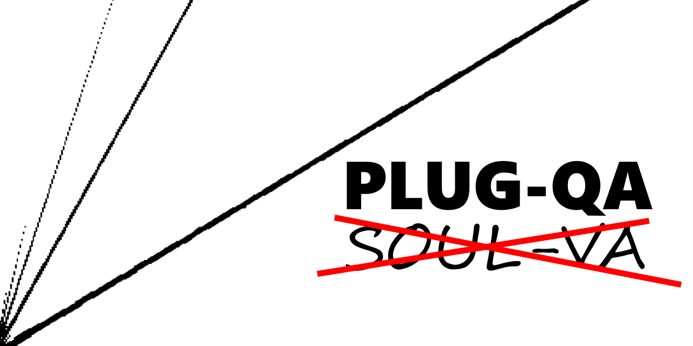

# PLUG-QA
PLUG-QA is a Quality Assurance (QA) program for audio plugin development (`.vst3`, `.component`, `.dll`, `.vst`, `.soulpatch`, and `.soul`). It displays step, frequency, gain, waveshaper, vectorscope, and spectrogram responses and renders audio files placed in `audioIn`.  

## NOTE: 
- This project is a work in progress. Only maintained for Octave on Windows, but should work for other OSes and Matlab with minimal tinkering.
- All non-SOUL plugins must support 2-2 channel layout even if that isn't the intended use case. This is not only a requirement for PLUG-QA, but also a common requirement for many DAWs.

## Dependencies:  
- [Octave 6.4.0](https://www.gnu.org/software/octave/download)
- [SOUL CLI 1.0.82](https://github.com/soul-lang/SOUL/releases/tag/1.0.82) (if testing .soulpatch or .soul plugins)
- included Git Submodules (run `updateSub.sh`)

## Contents
PLUG-QA has meaningful comments and function/variable names. Most users only need to run `qa.m` (function) or `qaScript.m` (script) and use their outputs in `results`.

## Useful Tools:
- [VS Code](https://code.visualstudio.com/)  
- [wav-preview](https://github.com/sukumo28/wav-preview)

## Contributing
Please post bugs in issues and features requests in discussions. Pull requests are allowed and encouraged, especially if they add new test signals to `qa.m`!

## Projects using PLUG-QA
[SOUL-VA](https://github.com/thezhe/SOUL-VA)

